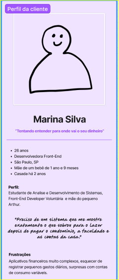
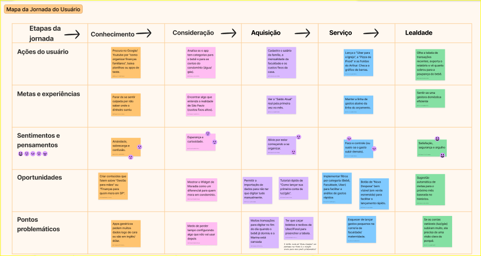
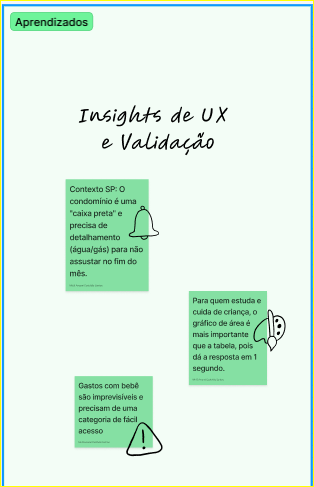

# 📐 UX Research: Dashboard Financeiro Doméstico

> Documentação estratégica do processo de pesquisa de experiência do usuário (UX Research) aplicado ao desenvolvimento de um ecossistema de controle financeiro moldado para a realidade de famílias urbanas em São Paulo.

Projeto desenvolvido como entrega do desafio prático de UX Research para a formação **UI/UX Design da DIO**, fundamentado pelos pilares de design centrado no ser humano do **Google UX Design Certificate**.

---

## 🚀 Diferencial Técnico: Engenharia de UX & Autoetnografia

Como desenvolvedora front-end com foco em UX, este projeto valida hipóteses de interface através de **Autoetnografia (Pesquisa Heurística de Cenário Real)**. Sendo a própria pesquisadora integrante direta do público-alvo (estudantes de tecnologia que administram a logística, estudos e o orçamento de uma moradia familiar na região metropolitana de SP), o processo de extração de dores e mapeamento de comportamento seguiu critérios técnicos de uso real.

---

## 🎯 1. Plano de Pesquisa

O planejamento foi estruturado para entender a carga mental envolvida na gestão de um orçamento familiar complexo, que equilibra investimentos em educação, despesas com filhos e custos habitacionais.

* **Objetivo Geral:** Investigar como gestores domésticos que acumulam jornadas de estudos e trabalho lidam com a organização financeira de prioridades e despesas semivariáveis.
* **Hipóteses:** 1. Interfaces financeiras puramente genéricas elevam a carga cognitiva ao misturar obrigações fixas com gastos voláteis.
  2. A segregação visual e o destaque de "Custos de Moradia" mitigam a ansiedade e clareiam a percepção do saldo líquido real do mês.

---

## 👤 2. Definição da Persona

Com base na consolidação dos dados de perfil e comportamento, a persona do projeto foi estruturada para personificar os padrões encontrados, servindo como guia para decisões de arquitetura e UI.

### Marina Silva, 26 anos — São Paulo
> *"Preciso de um sistema que me mostre exatamente o que sobrou para o lazer depois de garantir as contas fixas e os custos da casa, sem me fazer perder tempo com cálculos complexos."*

* **Comportamentos:** Organizada, multitarefa e focada na otimização de tempo. Divide as despesas visualmente por categorias rígidas no fechamento do mês.
* **Necessidades:** Clareza visual imediata da relação "Gastos vs. Orçamento" e acessibilidade rápida para lançamentos em tempo real.
* **Frustrações:** Aplicativos excessivamente poluídos, lentidão no fluxo de entrada de despesas rápidas (ex: transporte) e falta de previsibilidade em contas semivariáveis de condomínio.

---

## 🗺️ 3. Mapeamento da Jornada do Cliente (Journey Map)

O mapeamento detalha o fluxo completo do modelo mental do usuário ao longo do mês, mapeando ações, sentimentos e identificando pontos cruciais de atrito.

### Análise das Etapas da Jornada
A experiência foi fragmentada em 5 estágios cruciais para identificar onde o produto digital deve intervir:

1. **Conhecimento (Awareness):** O momento em que o usuário percebe a perda de controle orçamentário. O sentimento predominante é de ansiedade e sobrecarga perante aplicativos genéricos ou complexos.
2. **Consideração (Consideration):** Busca por soluções locais e contextualizadas. O usuário foca na análise se o sistema compreende custos reais (como despesas detalhadas de moradia).
3. **Aquisição (Trial / Entrada):** Entrada de dados macro (renda familiar e custos fixos). Ocorre uma transição para o alívio ao enxergar o saldo inicial real estruturado.
4. **Serviço (Uso Diário):** O cotidiano de lançamentos rápidos (Uber, alimentação fracionada, itens de bebê). É a fase crítica onde a correria do dia a dia pode gerar esquecimento de registros.
5. **Lealdade (Loyalty / Fechamento):** Análise retroativa do mês. Fornece o sentimento de controle, orgulho e segurança para o planejamento do próximo ciclo.

---

## 💡 4. Insights de UX & Validação do Design

A análise cruzada entre os pontos de atrito da jornada e os comportamentos gerou aprendizados consolidados estruturados por afinidade, que justificam diretamente o desenvolvimento do layout de duas telas do Dashboard:

* **Validação do Widget de Moradia:** Contas variáveis atreladas ao condomínio (Água, Luz, Gás de cozinha) atuam como uma "caixa preta" para o orçamento doméstico em São Paulo. O bloco exclusivo de *Custos de Moradia* incluído no design home responde diretamente a essa dor.
* **Validação do Botão de Ação Rápida:** O cansaço ao fim do dia impede o usuário de preencher fluxos longos de transações. O botão em Verde Esmeralda destacado na Home para "Nova Despesa" resolve o atrito da etapa de Serviço.
* **Abordagem Visual First:** Usuários com rotinas saturadas demandam respostas rápidas. O uso de um gráfico de área central ("Gastos vs Orçamento") substitui a necessidade de leitura analítica exaustiva de tabelas na tela principal.

---

## 🚀 Próximos Passos no Ciclo do Produto

Os resultados obtidos com esta pesquisa validaram com sucesso a viabilidade técnica e a utilidade prática do wireframe de alta fidelidade montado no Figma. 

- [x] Planejamento e Condução da Pesquisa (Autoetnografia)
- [x] Síntese de Dados e Criação da Persona (Marina Silva)
- [x] Mapeamento de Jornada e Identificação de Gaps
- [x] Prototipação de Alta Fidelidade (Figma)
- [ ] Construção do Design System Local (Cores semânticas e Tipografia)
- [ ] Desenvolvimento Front-End dos componentes utilizando Angular e PrimeNG

---

## 🛠️ Ferramentas Utilizadas
* **Figma:** Modelagem da Persona e Plano de Pesquisa.
* **FigJam:** Agrupamento de afinidades e mapeamento visual da jornada.
* **GitHub:** Versionamento de documentação técnica.

---

## ✍️ Autora

**Miriã Amaral**
* Front-End Developer (Angular/TypeScript) & UX Design Student
* 🔗 [LinkedIn Miriã Amaral Custódio Santos](https://www.linkedin.com/in/miriaamaralcs)
